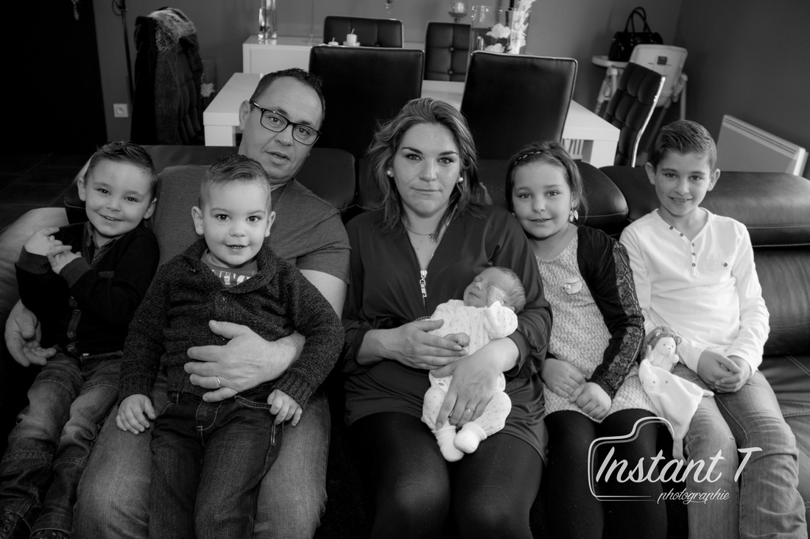
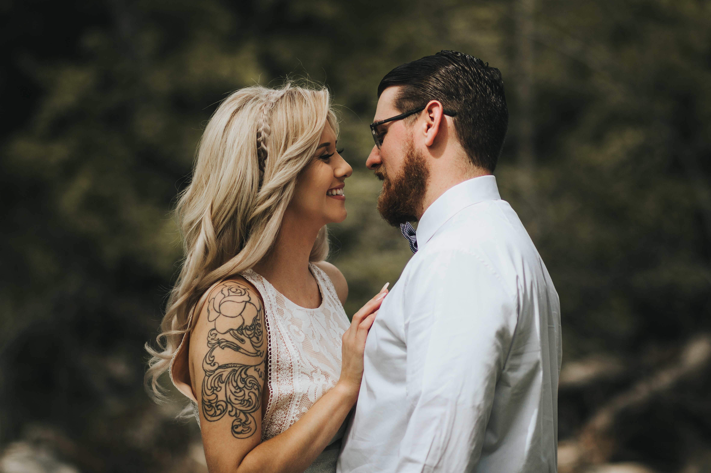
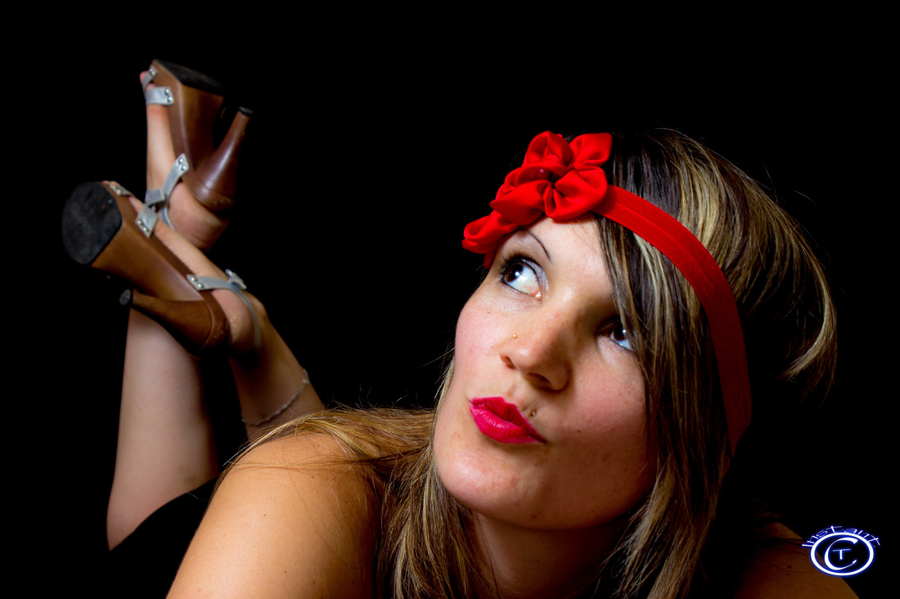
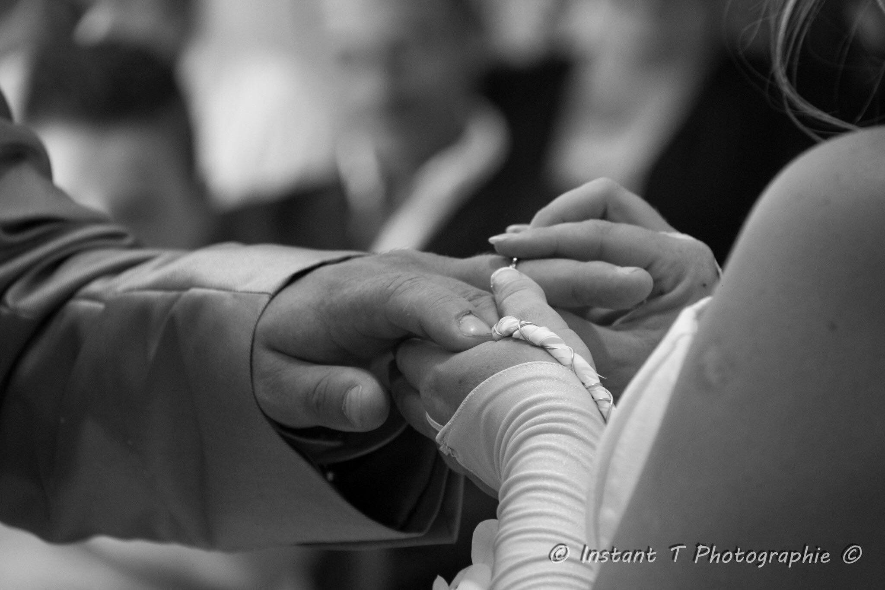
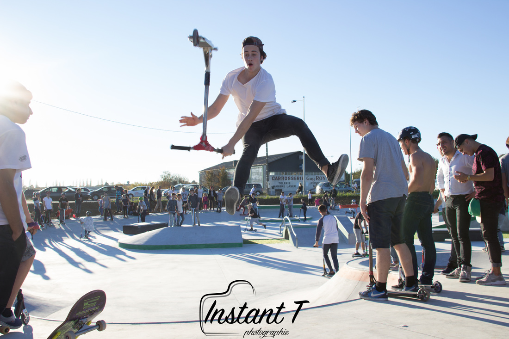

<!DOCTYPE html>
<html lang="fr">
    <head>
    <meta charset="UTF-8">
    <meta name="viewport" content="width=device-width,initial-scale=1.0">
    <meta http-equiv="X-UA-Compatible" content="ie=edge">
    <link rel="stylesheet" href="css/style.css" >
    <link rel="stylesheet" href="css/animate.css" >
    <!--link rel="stylesheet"  media="screen and (max-width: 400px)" href="css/petite-résolution.css"-->
    
    
    
    <title>INSTANT T PHOTO</title>
    
       
  
    
  </head>
  
  <body>
  

    

      <ul class="fly-in-text">
        <li>I</li>
        <li>N</li>
        <li>S</li>
        <li>T</li>
        <li>A</li>
        <li>N</li>
        <li>T</li>
        
        <li id="t">T</li>
      </ul>
      <a href="#enter" class="enter-button">ENTRER</a>
    

  

  

<nav class="navbar" id="nav">
    
      <a href="#a" onclick="openSlideMenu()">
        <svg width="40" height="40">
            <path d="M0,5 40,5" stroke="#fff" stroke-width="5"/>
            <path d="M0,14 40,14" stroke="#fff" stroke-width="5"/>
            <path d="M0,23 40,23" stroke="#fff" stroke-width="5"/>
            <path d="M0,32 40,32" stroke="#fff" stroke-width="5"/>
        </svg>
      </a>
    

    <ul class="navbar-nav">
      <li><a href="#enter">Acceuil</a></li>
      <li><a href="Page 2/Galerie2.html">Galerie</a></li>
      <li><a href="#tarif">Tarifs</a></li>
      <li><a href="#contact">Contact</a></li>
    </ul>
  </nav>

  

    <a href="#a" class="btn-close" onclick="closeSlideMenu()">&times;</a>
    <a href="#enter"  onclick="closeSlideMenu()">Acceuil</a>
    <a href="Page 2/Galerie2.html" onclick="closeSlideMenu()">Galerie</a>
    <a href="#tarif" onclick="closeSlideMenu()">Tarifs</a>
    <a href="#contact" onclick="closeSlideMenu()">Contact</a>
  

  

    <main>
      <!-- Landing Area -->
      

        

          

            <h1 class='elegantshadow'>INSTANT T Photographie</h1>
            <h2 class="souligne">Photographe Professionnel</h2>
            <a class="btn"  id="z" id="view-work" href="#images">
             Mes Images 
            </a>
          

        

        

          
        

      

  
      

        

          <h2 ><strong class="lu2">MON TRAVAIL</strong></h2>
        

    
        
        

          <h3><strong class="lu1" id="tarif">PHOTO DE FAMILLE</strong></h3>
          
<strong>_____________________</strong>

           
          
 Seul, en couple ou en famille, le portrait révèle la personnalité profonde du ou des modèles. A l'issue d'une séance, on obtient de belles images très différentes des photos de tous les jours. C'est aussi l'occasion de passer un bon moment à jouer à être la star du jour. Un cadeau à offrir ou à s'offrir à l'occasion d'un anniversaire, d'une St Valentin ou des fêtes de fin d'année.

           
          
TARIFS :

          
 séance de prise de vue d'une demi-heure, à domicile ou dans un lieu choisis en commun. Vous obtiendrez 8 Photos sur un CD ou un tirage 15x20 cm.

          
Tarif: 80€ + les frais de déplacement. 

        

        
        

          <h3><strong class="lu1">Naissances & Bâtemes:</strong></h3>
          
<strong>_____________________</strong>

           
          
Les Souvenirs pour nos tout petits.

           
          
TARIFS :

          
 séance de prise de vue d'une demi-heure, à domicile ou dans un lieu choisis en commun. Vous obtiendrez 8 Photos sur clé USB ou un tirage 15x20 cm.

          
Tarif: 80€ + les frais de déplacement. 

        

        
        

          <h3><strong class="lu1">Portrait de couple, en extérieur ou à domicile:</strong></h3>
          
<strong>_______________________________________________</strong>

           
          
 Une séance de prise de vue d'une à deux heures selon la motivation des modèles, dans des lieux choisis en commun. Utiliser l'environement naturel ou urbain permet des situations bien plus variées qu'en studio. Le jeux aidera les Modèles à se sentir à l'aise pour obtenir plus de naturel dans les attitudes.

           
          
TARIFS :

          
 Vous obtiendrez 25 Photos sur un CD ou 5 tirages 20x30 cm et 5 tirages 15x20 cm.
          Tarif : 250€ + les frais de déplacement 

        

        
        

          <h3><strong class="lu1">Photos de mode & Book professionnel :</strong></h3>
          
<strong>________________________________________</strong>

           
          
 Vos Photos de mode pour votre Book professionnel , agence et autres prestations promotionnelles artistique. Sur un site définit en commun et décors de mise en valeur, nous réaliserons les plus belles photos que vous pourrez présenter à vos futurs clients et employeurs.

            
          
 Pour une séances d'une heure minimum 

        

        
        

          <h3><strong class="lu1">MARIAGE :</strong></h3>
          
<strong>_____________</strong>

           
          
 Nous proposons le reportage photo de votre mariage.
           À partir d'un forfait de base à 350€, hors frais de déplacement, incluant :
          

           
          
Portrait de couple,
            Reportage de la cérémonie à la mairie,
             les fichiers-photo sur DVD et les droits de retirage des images chez le prestataire de votre choix,
               Vous pourrez choisir les étapes en plus dont vous souhaitez garder une trace en images, 
               de la préparation dès le matin jusqu'à la pièce montée..

        

        
        

          <h3><strong class="lu1">Sites et Évenements :</strong></h3>
          
<strong>________________________</strong>

           
          
Vous souhaitez promouvoir un site, événements sportifs, associations, ou tout simplement garder les plus belles images de ces lieux et instants Nous vous proposons la formule forfait et tous types de tirages décritent ci-dessus, mais aussi la réalisation de Poster de différentes tailles et qualités papier ainsi que des tee-shirts, gobelets, agenda et une multitude de support aux meilleurs prix du marché et qui vous seront livrés directement dans les meilleurs délais grace a notre partenaire de production.

              
          
Tarifs et frais d'envois informé sur demande de devis

        

        
        

          <h3><strong class="lu1">Pack-shot et Étude en studio :</strong></h3>
          
<strong>________________________________</strong>

           
          
Photo technique pour des catalogues et modes d'emploi ou étude artistique pour des tirages de grande taille.

        

        

          
        

      

    </main>

    <footer>
        <h1>Me Contacter</h1>
        <h3>Cliquez ci-dessous</h3>
        <button class="btnA" id="contact"> </button>
      <!--div class="footerdiv" id="contact">
        <button class="footerbutton"></button>
        
      </div-->
      <!--h2><strong>ME CONTACTER</strong></h2>
      
Email:
        <strong>contact@instant-t36.com</strong>
      

      
Téléphone:
        <strong>07.81.95.56.45</strong>
      </p-->
       
      <!--modal-->
      <button class="btnA" id="myBtn"></button>

      

      

        &times;
        <form action="" method="get">
          

            <label class="aa" for="Noms">Votre nom :</label> 
            <input class="saisie" type="text" name="name"id="name" placeholder="Ex: Dupont" size="30" 
            maxlength="20"/>
            

            <label class="aa" for="Noms">Votre prénom :</label> 
            <input class="saisie" type="text" name="name"id="name" placeholder="Ex: Nicolas" size="30" 
            maxlength="20"/>
          

          

          <label class="aa" for="Noms">Votre Numéro :</label> 
          <input class="saisie" type="text" name="name"id="name" placeholder="N°:" size="30" 
          maxlength="10"/>
          

        

        <label class="aa" for="Noms">Votre Email :</label> 
        <input  class="saisie" type="text" name="name"id="name" placeholder="Email:" size="30" 
        maxlength="40"/>
      

      

        <label class="aa" for="Noms">Votre Message :</label> 
        <textarea class="saisie" type="text" name="name"id="name" placeholder="Message:"></textarea>
      

        </form>
      

    

    
    </footer>
    
      
  
  
  
  
  
  
  </body></html>
